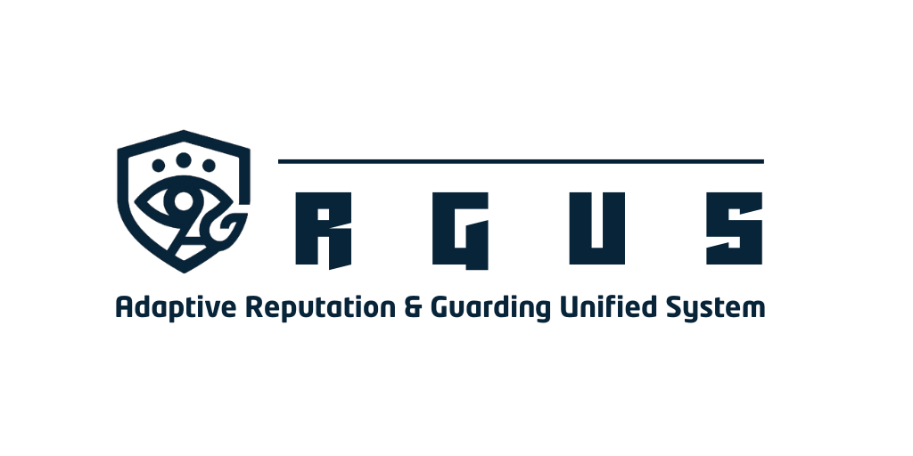

# ARGUS v4.0.0
## Adaptive Reputation & Guarding Unified System



ARGUS is a research-grade Threat Intelligence Aggregation and Automated IP Blocking System designed to integrate multiple Threat Intelligence Platforms (TIP) and automate firewall enforcement.

It aggregates reputation data from heterogeneous intelligence sources, computes a weighted threat score, and optionally performs automated blocking actions on supported firewalls.

**ARGUS IMPLEMENTATION (EXAMPLE)**


------------------------------------------------------------------------
## 1. Research Objectives
ARGUS is designed for:
- Implemented in Shuffle SOAR or n8n _workflow_ 
- Threat Intelligence correlation research
- Automated SOC workflow experimentation
- Reputation scoring model evaluation
- Firewall automation studies
- Threat feed normalization research
------------------------------------------------------------------------
## 2. Core Architecture
Observable (IP / Hash)  from SIEM

↓

Multi-Source Threat Intelligence Aggregation 

↓

Weighted Scoring Engine 

↓ 

Decision Engine 

↓ 

Firewall Automation (Sangfor / Mikrotik) 

↓ 

Logging & Reporting (PDF / Nextcloud)

------------------------------------------------------------------------
## 3. Threat Intelligence Sources
### IPv4 Intelligence
- VirusTotal
- AbuseIPDB
- CrowdSec
- CriminalIP
- ThreatBook
- Internal Blocklist
- OpenCTI (optional)

### Hash Intelligence
- VirusTotal
- Yaraify
- Malware Bazaar
- Malprobe
- OpenCTI (optional)

------------------------------------------------------------------------
## 4. Scoring Engine Model
ARGUS uses a weighted scoring model.
### IP Weights
| TIP | Weight |
| - | - |
| VirusTotal | 0.10 |
| Blocklist | 0.30 (0.25 if OpenCTI enabled) |
| AbuseIPDB| 0.30 |
| CrowdSec| 0.15 |
| CriminalIP| 0.05 |
| ThreatBook| 0.10 |
| OpenCTI| 0.05 |
  
### Hash Weights
| TIP | Weight |
| - | - |
| VirusTotal | 0.35 (0.30 if OpenCTI enabled) |
| Yaraify| 0.15 (0.05 if OpenCTI enabled) |
| Malware Bazaar| 0.20 (0.15 if OpenCTI enabled) |
| Malprobe| 0.30 (0.25 if OpenCTI enabled) |
| OpenCTI| 0.25 (optional) |

**Note**
1. Weights dynamically adjust if OpenCTI is configured
2. The weight of TIPs that fail to obtain results (due to rate limits or request timeouts) will be summed up and distributed to successful TIPs.
3. Test

------------------------------------------------------------------------
## 5. API Endpoints
| Endpoint | Endpoint Description | Type | Parameters | Param Description |
| - | - | - | - | - |
| GET /home | Default Index | - | - | - |
| GET /check | Check observable status | - | observable | IP or Hash (required) |
| POST /analyze | Analyze IPv4 or Hash Observable threat score | JSON | observable<br>frequency (int)<br>groups (array)<br>response_code (int)<br>level (int) | IP or Hash (SHA1\|SHA256\|SHA384\|SHA128 required)<br>Alert frequency on SIEM<br>SIEM Rule Groups<br>HTTP Response (Optional/For web attack)<br>Rule Level | 
| POST /action | IP Blocking | JSON | ip_address (IPv4)<br>description (String)<br>type (BLACK)<br>enable (bool)<br>blockmode (String) | IPv4 to be blocked<br>Block description for Firewall<br>Sangfor only (Must be Black)<br>Blocking Status (Sangfor only)<br>Blocking duration (30m\|1h\|..\|7d\|permanent) |
| POST /blocklist | Show blocked IP Address | JSON | date_start (datetime)<br>date_end (datetime)<br>limit (int)<br>offset (int) | Start Date (YYYY-MM-DD HH:ii:ss)<br>End Date (YYYY-MM-DD HH:ii:ss)<br>Data limit (Default: 10) | Data offset (Default: 0) |
| POST /jobs | Get job history | JSON | date_start (datetime)<br>date_end (datetime)<br>limit (int)<br>offset (int) | Start Date (YYYY-MM-DD HH:ii:ss)<br>End Date (YYYY-MM-DD HH:ii:ss)<br>Data limit (Default: 10) | Data offset (Default: 0) |
| GET /create24h-report | Generate 24-hour blocklist report to PDF file. | - | - | - |

**Authentication required via Bearer Token.**

### Analyze Results Sample
Request
```POST
POST /analyze
{
    "observable": "180.242.130.19",
    "frequency": 10,
    "groups": ["webshell"],
    "response_code": 404,
    "level": 11
}
```
Response
```JSON
{
    "code": 200,
    "error": null,
    "message": "Ok",
    "results": {
        "id": "019c5a88-e483-70ff-80a0-a87a281d944f",
        "observable": "180.242.130.19",
        "scores": {
            "virustotal": 24,
            "malware_bazaar": 0,
            "yaraify": 0,
            "malprobe": 0,
            "criminalip": 0,
            "blocklist": 0,
            "crowdsec": 20,
            "abuseipdb": 0,
            "threatbook": 28,
            "overall": {
                "score": 53.16,
                "wazuh_rule_score": 74,
                "tip_score": 21.9,
                "weights": [
                    {
                        "virustotal": 0.4750000000000001,
                        "blocklist": 0,
                        "abuseipdb": 0,
                        "crowdsec": 0.525,
                        "criminalip": 0,
                        "threatbook": 0,
                        "opencti": 0
                    },
                    {
                        "virustotal": true,
                        "blocklist": false,
                        "abuseipdb": false,
                        "crowdsec": true,
                        "criminalip": false,
                        "threatbook": false,
                        "opencti": false
                    }
                ]
            },
            "opencti": 0
        },
        "classification": {
            "virustotal": "Unknown",
            "crowdsec": [
                "Residential IP"
            ]
        },
        "decision": {
            "notification": true,
            "abuse_report": true,
            "blockmode": "7d"
        },
        "ip_info": {
            "status": "success",
            "country": "Indonesia",
            "countryCode": "ID",
            "region": "JK",
            "regionName": "Jakarta",
            "city": "Jakarta",
            "zip": "12970",
            "lat": -6.2114,
            "lon": 106.8446,
            "timezone": "Asia/Jakarta",
            "isp": "PT. TELKOM INDONESIA",
            "org": "",
            "as": "AS7713 PT Telekomunikasi Indonesia",
            "query": "180.242.130.19",
            "isPublic": true
        },
        "type": "ip",
        "description": "IP analysis based on multiple TIPs (Scores 53.16)",
        "country_code": "ID",
        "success_source": "2/7"
    }
}
```
------------------------------------------------------------------------
## 6. Environment Configuration
### Root .env
    MYSQL_ROOT_PASSWORD= 
    MYSQL_DATABASE= 
    MYSQL_USER= 
    MYSQL_PASSWORD=
### ./argus/.env

    DB_HOST=mariadb 
    DB_USER= 
    DB_PASS= 
    DB_NAME=

    API_AUTH_TOKEN=
        
    FW_TYPE= # SANGFOR or MIKROTIK 
    FW_HOST= 
    FW_AUTH= 
    FW_USER= 
    FW_PASS= 
    FW_PORT=
    
    OPENCTI_URL= 
    OPENCTI_API_KEY=

    VT_API_KEY= 
    CROWDSEC_API_KEY= 
    ABUSECH_API_KEY= 
    MALPROBE_API_KEY=
    ABUSEIP_API_KEY= 
    CRIMINALIP_API_KEY= 
    THREATBOOK_API_KEY=
    
    ARGUS_CONCURRENCY=7 
    
    FORCE_REANALYZE=90
    
    NEXTCLOUD_BASE= 
    NEXTCLOUD_DAV= 
    NEXTCLOUD_DIR= 
    NEXTCLOUD_USER=
    NEXTCLOUD_PWD=
    
    OPENAI_KEY= 
    OPENAI_ORG= 
    OPENAI_PROJ=
------------------------------------------------------------------------
## 7. Docker Deployment
Development:

    make dev-build
    make dev-up
    make dev-logs
    make dev-shell

Production:

    make prod-build
    make prod-up
    make prod-logs

Utilities:

    make composer-install
    make composer-update
    make db-backup
    make monitor
    make clean
------------------------------------------------------------------------
## 8. Logging
  
Threat Analysis Log: logs/argus_tip.log
FireHOL blocklist crawling execution log: /var/log/ip-blocklist.log

------------------------------------------------------------------------
## 9. 24-Hour PDF Report

The system can generate a 24-hour blocklist report including:
- Threat distribution
- Top attacking ASNs
- Risk scoring distribution
- Permanent vs Temporary block analysis
------------------------------------------------------------------------
## 10. Security Considerations

- All endpoints require Bearer token authentication
- API keys must be stored securely
- Firewall credentials must not be exposed
- Rate limiting recommended in production
- TLS termination required in public deployment
------------------------------------------------------------------------
## 11. Research Extensions
Possible future research directions:
- Machine Learning based scoring
- Behavioral anomaly scoring
- Adaptive weight tuning
- Threat actor clustering
- Graph-based intelligence correlation
------------------------------------------------------------------------
Author: Muhammad Ridwan Na'im Version: 4.0.0
